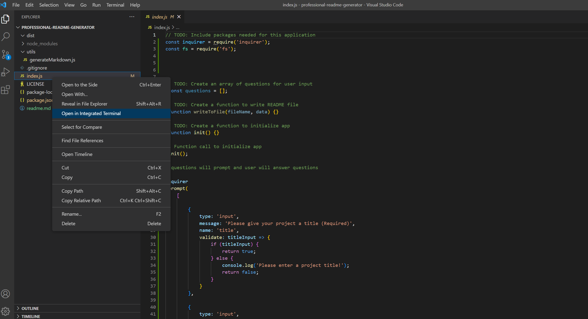

[![Contributors][contributors-shield]][contributors-url]
[![Forks][forks-shield]][forks-url]
[![Stargazers][stars-shield]][stars-url]
[![Issues][issues-shield]][issues-url]
[![MIT License][license-shield]][license-url]

<!-- PROJECT LOGO -->
 

    

  <h3 align="center">A README FOR A README GENERATOR</h3>

  

    Welcome to the Professional Readme Geneartor README, a great spot to get to know this project!
     
    <a href="https://github.com/danpoggetti/professional-readme-generator"><strong>Explore the docs »</strong></a>
     
     
    <a href="https://danpoggetti.github.io/professional-readme-generator/">View Demo</a>
    ·
    <a href="https://github.com/danpoggetti/professional-readme-generator/issues">Report Bug</a>
    ·
    <a href="https://github.com/danpoggetti/professional-readme-generator/issues">Request Feature</a>
  

<!-- TABLE OF CONTENTS -->

  
Table of Contents

  <ol>
    <li>
      <a href="#about-the-project">About The Project</a>
      <ul>
        <li><a href="#built-with">Built With</a></li>
      </ul>
    </li>
    <li><a href="#getting-started">Getting Started</a></li>
    <li><a href="#usage">Usage</a></li>
    <li><a href="#roadmap">Roadmap</a></li>
    <li><a href="#contributing">Contributing</a></li>
    <li><a href="#license">License</a></li>
    <li><a href="#contact">Contact</a></li>
    <li><a href="#acknowledgments">Acknowledgments</a></li>
  </ol>

<!-- ABOUT THE PROJECT -->
## About The Project

I was tasked to create a professional readme generator tool.

I want a user to be able to:
<ol>
<li>Be prompted with questions about their project.</li> 
<li>Answer questions from prompts and have those answers stored.</li> 
<li>When the user is finished, a file is automatically created in the dist folder for them to retrieve.</li>
</ol>

 

(<a href="#readme-top">back to top</a>)

### Built With

Below are the following technologies and applications utilized to help build the project. 

VS Code 
JavaScript 
HTML 
Node.js 

(<a href="#readme-top">back to top</a>)

<!-- GETTING STARTED -->
## Getting Started

Below you'll be able to see screen shots of the deployed app. You can also view the road map to see how you can test it locally.

(<a href="#readme-top">back to top</a>)

<!-- USAGE EXAMPLES -->
## Usage

Here's a screen shot of what the app looks like when someone runs the command line to start the app.

(<a href="#readme-top">back to top</a>)

<!-- ROADMAP -->
## Roadmap

- [ ] Let's get an auto generated readme.md file!
- [ ] Type node index.js in terminal
- [ ] The app will display the following inquier prompts:
    - [ ] Enter project name
    - [ ] Enter project description
    - [ ] Select languages used to build app
    - [ ] Tell people how to use app
    - [ ] Tell people how to contribute to app
    - [ ] Select license type
    - [ ] Enter your git username
    - [ ] Enter your git email
    - [ ] Enter acknowledgements if needed

See the [open issues](https://github.com/danpoggetti/professional-readme-generator/issues) for a full list of proposed features (and known issues).

(<a href="#readme-top">back to top</a>)

<!-- CONTRIBUTING -->
## Contributing

I strongly feel that contributing well throught and engaging suggestions are instrumental. I am an avid learner and want to let you know any contribution or suggestions are apprecaited.

If you truly believe you can contribute to making this website better, please fork the repo and create a pull request. If you do not wish to fork, you can open and create an issue with the tag "enhancement" or "suggestions". I will then be able to review it and take it into consideration. Lastly, please don't forget to give the project a star!

1. Fork the Project
2. Create your Feature Branch (`git checkout -b feature/newSuggestion`)
3. Commit your Changes (`git commit -m 'Add some NewSuggestion'`)
4. Push to the Branch (`git push origin feature/NewSuggestion`)
5. Open a Pull Request

(<a href="#readme-top">back to top</a>)

<!-- LICENSE -->
## License

Distributed under the MIT License. 
Copyright (c) 2022 Dan Poggetti 
See License.text for more information.

(<a href="#readme-top">back to top</a>)

<!-- CONTACT -->
## Contact

Dan Poggetti - GitHub [https://github.com/danpoggetti]

Project Link: [https://github.com/danpoggetti/professional-readme-generator]

Demo Link: [https://danpoggetti.github.io/professional-readme-generator/]

(<a href="#readme-top">back to top</a>)

<!-- ACKNOWLEDGMENTS -->
## Acknowledgments

I want to acknowledge the many great and vast resouces that adided us in creating this readme generator app.

* [Google](https://www.google.com)
* [YouTube](https://www.youtube.com)
* [GitHub Pages](https://pages.github.com)
* Jared Saldate
* [README Template courtesy of othneildrew](https://github.com/othneildrew/Best-README-Template)
* [MIT License text](https://mit-license.org/license.txt)
* [Shields.io for badges](https://shields.io/)

(<a href="#readme-top">back to top</a>)

<!-- MARKDOWN LINKS & IMAGES -->
<!-- https://www.markdownguide.org/basic-syntax/#reference-style-links -->
[contributors-shield]: https://img.shields.io/github/contributors-anon/danpoggetti/professional-readme-generator?style=for-the-badge
[contributors-url]: https://github.com/danpoggetti/professional-readme-generator/graphs/contributors
[forks-shield]: https://img.shields.io/github/forks/danpoggetti/professional-readme-generator?style=for-the-badge
[forks-url]: https://github.com/danpoggetti/professional-readme-generator/network/members
[stars-shield]: https://img.shields.io/github/stars/danpoggetti/professional-readme-generator?style=for-the-badge
[stars-url]: https://github.com/danpoggetti/professional-readme-generator/stargazers
[issues-shield]: https://img.shields.io/github/issues/danpoggetti/professional-readme-generator?style=for-the-badge
[issues-url]: https://github.com/danpoggetti/professional-readme-generator/issues
[license-shield]: https://img.shields.io/github/license/danpoggetti/professional-readme-generator?style=for-the-badge
[license-url]: https://github.com/danpoggetti/professional-readme-generator/blob/main/LICENSE
[product-screenshot]: images/screenshot.png